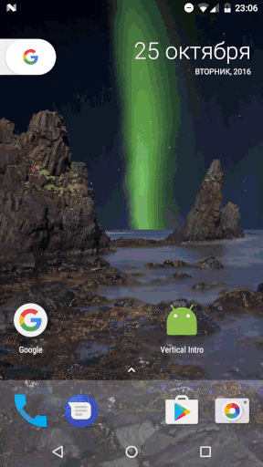
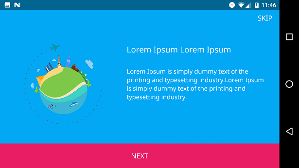
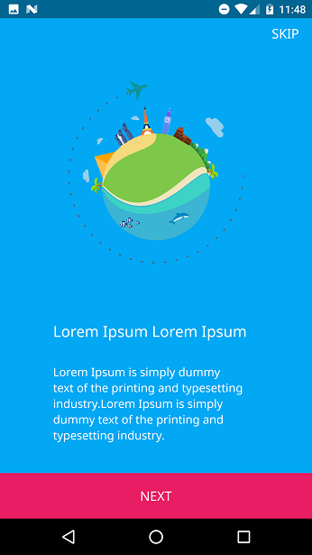
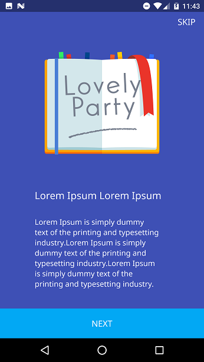

# Vertical-Intro

Vertical intro allows you to integrate material vertical intro to your app



The current minSDK version is API level 14 Android 4.0 (ICE CREAM SANDWICH).

 

## Download sample [apk][0]
[0]: https://github.com/armcha/Vertical-Intro/raw/master/screens/verticalIntro.apk

#YouTube demo

[](https://www.youtube.com/watch?v=VnQz75ekcSc)

#Installation
-----------------------
Gradle:
```groovy
compile 'com.github.armcha:Vertical-Intro:1.0.0'
```

# Setup and usage
-----------------------
## Step 1:
Your Activity must extend VerticalIntro and implement methods

```java 
public class TestActivity extends VerticalIntro
```

## Step 2:

Add activity to manifest with defined theme:

```xml
<activity
android:name=".TestActivity"
android:theme="@style/VerticalIntroStyle" />
```

## Step 3:

Add items in init

```java
addIntroItem(new VerticalIntroItem.Builder()
                .backgroundColor(R.color.my_color)
                .image(R.drawable.my_drawable)
                .title("Lorem Ipsum Lorem Ipsum")
                .text("Lorem Ipsum is simply dummy text of the printing and typesetting industry." +
                        "Lorem Ipsum is simply dummy text of the printing and typesetting industry." +
                        "Lorem Ipsum is simply dummy text of the printing and typesetting industry.")
                .build());
```

Return color for last item bottom view background color
```java
 @Override
    protected Integer setLastItemBottomViewColor() {
        return R.color.my_second_color;
    }
```

# Customize
## Note: You must do all customizations inside init method

Enable or disable skip button

```java
setSkipEnabled(true); 
```
----------------------------------

Enable or disable vibrate :vibration_mode: and set vibrate intensity
```java
setVibrateEnabled(true);
setVibrateIntensity(20);
```
----------------------------------

Set your texts
```java
setNextText("OK");
setDoneText("FINISH HIM");
setSkipText("GO GO");
```
----------------------------------

Set custom font
```java
setCustomTypeFace(Typeface.createFromAsset(getAssets(), "fonts/NotoSans-Regular.ttf"));
```
#


## Contact 

Pull requests are more than welcome.
Please fell free to contact me if there is any problem when using the library.

- **Email**: armcha01@gmail.com
- **Facebook**: https://web.facebook.com/chatikyana
- **Google +**: https://plus.google.com/112011638040018774140
- **Website**: http://luseen.com/

License
--------


      Space Navigation library for Android
      Copyright (c) 2016 Arman Chatikyan (https://github.com/armcha/Vertical-Intro).
      
      Licensed under the Apache License, Version 2.0 (the "License");
      you may not use this file except in compliance with the License.
      You may obtain a copy of the License at

         http://www.apache.org/licenses/LICENSE-2.0

      Unless required by applicable law or agreed to in writing, software
      distributed under the License is distributed on an "AS IS" BASIS,
      WITHOUT WARRANTIES OR CONDITIONS OF ANY KIND, either express or implied.
      See the License for the specific language governing permissions and
      limitations under the License.
    

